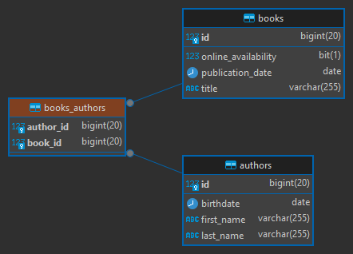

# [Spring Boot + Spring Data JPA | CRUD](https://www.youtube.com/watch?v=s7a9aVGxwxs)

Tutorial tomado del canal de **Joas Dev**

---

## Dependencias

````xml
<!--Spring Boot 3.2.2-->
<!--Java 21-->
<dependencies>
    <dependency>
        <groupId>org.springframework.boot</groupId>
        <artifactId>spring-boot-starter-data-jpa</artifactId>
    </dependency>
    <dependency>
        <groupId>org.springframework.boot</groupId>
        <artifactId>spring-boot-starter-web</artifactId>
    </dependency>

    <dependency>
        <groupId>com.mysql</groupId>
        <artifactId>mysql-connector-j</artifactId>
        <scope>runtime</scope>
    </dependency>
    <dependency>
        <groupId>org.projectlombok</groupId>
        <artifactId>lombok</artifactId>
        <optional>true</optional>
    </dependency>
    <dependency>
        <groupId>org.modelmapper</groupId>
        <artifactId>modelmapper</artifactId>
        <version>3.2.0</version>
    </dependency>
    <dependency>
        <groupId>org.springframework.boot</groupId>
        <artifactId>spring-boot-starter-test</artifactId>
        <scope>test</scope>
    </dependency>
</dependencies>
````

## Configurando application.yml

Vamos a configurar las propiedades de conexión a la base de datos y agregar configuraciones adicionales:

````yml
server:
  port: 8080
  error:
    include-message: always

spring:
  application:
    name: spring-boot-web-crud

  datasource:
    url: jdbc:mysql://localhost:3306/db_spring_boot_web_crud
    username: admin
    password: magadiflo

  jpa:
    hibernate:
      ddl-auto: update
    properties:
      hibernate:
        format_sql: true

logging:
  level:
    org.hibernate.SQL: DEBUG
````

## Configurando CORS y creando Bean Model Mapper

Creamos la clase de configuración `AppConfig` que implementa la interfaz `WebMvcConfigurer`. Gracias a esa
implementación podemos sobreescribir el método `addCorsMappings(CorsRegistry registry)` para configurar el `CORS`.
Es importante notar que se está definiendo los `@Value()` con el nombre de las configuraciones
que podríamos colocar en el `application.yml`, de esa manera si más adelante quisiéramos agregar alguna configuración
al cors, simplemente agregamos el nombre de la configuración correspondiente en el archivo yml. Sin embargo, tal cual
está ahora nuestro `application.yml` no tiene ninguna de esas configuraciones definidas, por lo tanto se tomará
por defecto el valor después de los `dos puntos (:)` en cada propiedad. Por ejemplo, del siguiente atributo se está
tomando el valor por defecto `/**` ya que no está configurado en el application.yml:

````
@Value("${app.cors.pathPattern:/**}")
private String pathPattern;
````

Además de la configuración del cors, vamos a configurar el `@Bean` del `ModelMapper` para usarlo más adelante en la
aplicación:

````java

@Slf4j
@Configuration
public class AppConfig implements WebMvcConfigurer {

    @Value("${app.cors.pathPattern:/**}")
    private String pathPattern;

    @Value("${app.cors.allowedOrigins:*}")
    private String[] allowedOrigins;

    @Value("${app.cors.allowedHeaders:*}")
    private String[] allowedHeaders;

    @Value("${app.cors.allowedMethods:*}")
    private String[] allowedMethods;

    @Value("${app.cors.maxAge:1800}")
    private long maxAge;

    @Override
    public void addCorsMappings(CorsRegistry registry) {
        log.info("pathPattern: {}", this.pathPattern);
        log.info("allowedOrigins: {}", Arrays.toString(this.allowedOrigins));
        log.info("allowedMethods: {}", Arrays.toString(this.allowedMethods));
        log.info("maxAge: {}", maxAge);

        registry.addMapping(this.pathPattern)
                .allowedHeaders(this.allowedHeaders)
                .allowedOrigins(this.allowedOrigins)
                .allowedMethods(this.allowedMethods)
                .maxAge(this.maxAge);
    }

    @Bean
    public ModelMapper modelMapper() {
        ModelMapper modelMapper = new ModelMapper();
        modelMapper.getConfiguration()
                .setFieldMatchingEnabled(true)
                .setFieldAccessLevel(org.modelmapper.config.Configuration.AccessLevel.PRIVATE);
        return modelMapper;
    }
}
````

**NOTA**

> Existe otra manera de configurar el cors y es creando un<br>
> **@Bean<br>
> public CorsFilter corsFilter() {...}**<br>
> Ese tipo de configuración lo realizamos en el curso de **Get Arrays**

Sobre la definición del `@Bean ModelMapper`, normalmente el `@Bean` solo regresaría el objeto sin ninguna configuración
adicional, es decir, sería de la siguiente manera:

````java

@Bean
public ModelMapper modelMapper() {
    return new ModelMapper();
}
````

Ahora, observamos que en la definición que realicé del `@Bean ModelMapper` de la clase `AppConfig` agregué
configuraciones adicionales **¿por qué?**, porque cuando realicé pruebas, con las entidades, repositorios y servicios
construidos, al momento de realizar el mapeo entre un DTO y una Entidad, estas no se poblaban, es decir los campos
de la entidad destino siempre terminaban siendo `null`. Entonces, buscando la solución encontré que debería agregar
dichas configuraciones extras:

````java

@Bean
public ModelMapper modelMapper() {
    ModelMapper modelMapper = new ModelMapper();
    modelMapper.getConfiguration()
            .setFieldMatchingEnabled(true)
            .setFieldAccessLevel(org.modelmapper.config.Configuration.AccessLevel.PRIVATE);
    return modelMapper;
}
````

**DONDE**

- `modelMapper.getConfiguration()`: Este método obtiene la configuración actual de ModelMapper. La configuración es
  donde se pueden establecer varias opciones y ajustes para controlar el comportamiento de ModelMapper.

- `.setFieldMatchingEnabled(true)`: Esta línea **habilita la coincidencia de campos.** Cuando está habilitada,
  **ModelMapper intentará mapear campos con nombres similares automáticamente.** Por ejemplo, si tienes un campo llamado
  `firstName` en la clase de origen y un campo llamado `firstName` en la clase de destino, ModelMapper los mapeará
  automáticamente.
- `.setFieldAccessLevel(org.modelmapper.config.Configuration.AccessLevel.PRIVATE)`: Esto establece el nivel de acceso a
  los campos. Aquí, estás configurando ModelMapper para que pueda acceder a campos privados durante el mapeo. Esto
  significa que ModelMapper puede acceder a campos privados de las clases que estás mapeando, lo que es útil si tienes
  campos privados en tus clases que necesitas mapear.

## Creando excepción personalizada

````java

@Getter
public class ApiException extends RuntimeException {

    private final HttpStatus httpStatus;

    public ApiException(String message, HttpStatus status) {
        super(message);
        this.httpStatus = status;
    }
}
````

## Definiendo Entidades y relaciones de Muchos a Muchos

Vamos a trabajar con una relación de `Muchos a Muchos` entre `Author` y `Book`, pero en este proyecto no usaremos la
anotación `@ManyToMany`, ya que esta anotación nos crea automáticamente una tabla intermedia. En nuestro caso, seremos
nosotros mismos quienes crearemos la tabla intermedia a través de una entidad mapeada a la base de datos.

### Entidad Author y Book

````java

@AllArgsConstructor
@NoArgsConstructor
@Data
@Builder
@Entity
@Table(name = "authors")
public class Author {
    @Id
    @GeneratedValue(strategy = GenerationType.IDENTITY)
    private Long id;
    private String firstName;
    private String lastName;
    private LocalDate birthdate;
}
````

````java

@AllArgsConstructor
@NoArgsConstructor
@Data
@Builder
@Entity
@Table(name = "books")
public class Book {
    @Id
    @GeneratedValue(strategy = GenerationType.IDENTITY)
    private Long id;
    private String title;
    private LocalDate publicationDate;
    @Builder.Default
    private Boolean onlineAvailability = false;
}
````

### Entidad de relación usando clave primaria compuesta

Es importante recordar que cuando utilizas una entidad de relación como esta, `debes manejar la persistencia de la misma
manualmente`. **Por ejemplo, cuando guardas una relación entre un book y un author, necesitarás crear una instancia de
BookAuthor y persistirla en tu contexto de persistencia.**

Primero necesitamos crear nuestra clase `BookAuthorPK`, que será la clase que represente la `clave primaria compuesta`
para nuestra tabla intermedia.

````java

@AllArgsConstructor
@NoArgsConstructor
@Data
@Builder
@Embeddable
public class BookAuthorPK {

    @ManyToOne
    @JoinColumn(name = "book_id")
    private Book book;

    @ManyToOne
    @JoinColumn(name = "author_id")
    private Author author;

}
````

**DONDE**

- `@Embeddable`, especifica una clase cuyas instancias se almacenan como parte intrínseca de una entidad propietaria y
  comparten la identidad de la entidad. Cada una de las propiedades o campos persistentes del objeto incrustado se
  asigna a la tabla de base de datos de la entidad.

Representamos una `clave primaria compuesta` en Spring Data utilizando la anotación `@Embeddable` en una clase. Luego,
esta clave se incrusta en la clase de entidad correspondiente de la tabla como clave principal compuesta mediante el uso
de la anotación `@EmbeddedId` en un campo del tipo `@Embeddable`.

Ahora toca definir la entidad que mapeará a nuestra tabla intermedia donde hacemos uso de la clase `BookAuthorPK`
creada en el apartado superior:

````java

@AllArgsConstructor
@NoArgsConstructor
@Data
@Builder
@Entity
@Table(name = "books_authors")
public class BookAuthor {

    @EmbeddedId
    private BookAuthorPK id;

}
````

**DONDE**

- `@EmbeddedId`, se aplica a un campo persistente o propiedad de una clase de entidad o superclase asignada para indicar
  una `clave primaria compuesta` que es una clase integrable (`@Embeddable`). La clase integrable debe anotarse
  como `@Embeddable`. Solo debe haber una anotación `EmbeddedId` y ninguna anotación `Id` cuando se utiliza la anotación
  `EmbeddedId`.

### Ejecutando la aplicación

Al ejecutar la aplicación veremos el siguiente log en consola:

````bash
2024-02-20T00:11:50.249-05:00 DEBUG 13320 --- [spring-boot-web-crud] [           main] org.hibernate.SQL                        : 
    create table authors (
        id bigint not null auto_increment,
        birthdate date,
        first_name varchar(255),
        last_name varchar(255),
        primary key (id)
    ) engine=InnoDB
2024-02-20T00:11:50.352-05:00 DEBUG 13320 --- [spring-boot-web-crud] [           main] org.hibernate.SQL                        : 
    create table books (
        id bigint not null auto_increment,
        online_availability bit,
        publication_date date,
        title varchar(255),
        primary key (id)
    ) engine=InnoDB
2024-02-20T00:11:50.409-05:00 DEBUG 13320 --- [spring-boot-web-crud] [           main] org.hibernate.SQL                        : 
    create table books_authors (
        author_id bigint not null,
        book_id bigint not null,
        primary key (author_id, book_id)
    ) engine=InnoDB
2024-02-20T00:11:50.464-05:00 DEBUG 13320 --- [spring-boot-web-crud] [           main] org.hibernate.SQL                        : 
    alter table books_authors 
       add constraint FK3qua08pjd1ca1fe2x5cgohuu5 
       foreign key (author_id) 
       references authors (id)
2024-02-20T00:11:50.583-05:00 DEBUG 13320 --- [spring-boot-web-crud] [           main] org.hibernate.SQL                        : 
    alter table books_authors 
       add constraint FK1b933slgixbjdslgwu888m34v 
       foreign key (book_id) 
       references books (id)
````

Y si usamos `DBeaver` para ver el diagrama en la base de datos, veremos que las tablas y sus relaciones se han
creado correctamente:



## Creando los repository

Hasta el momento tenemos creado tres entidades `Author`, `Book` y la entidad que relaciona ambas entidades `BookAuthor`.
Ahora, llega el momento de crear para cada una de ellas su respectivo `repository`:

### IBookRepository

Esta interfaz extiende a las interfaces propias de Spring Data, donde:

- `CrudRepository`, es una interfaz que nos provee operaciones **CRUD** genéricas en un repositorio para un tipo
  específico.
- `PagingAndSortingRepository`, proporciona una abstracción útil para trabajar con operaciones de paginación y
  ordenamiento en repositorios de datos. Fragmento del repositorio para proporcionar métodos para recuperar entidades
  utilizando la abstracción de paginación y clasificación. **En muchos casos, esto se combinará con `CrudRepository` o
  similar o con métodos agregados manualmente para proporcionar la funcionalidad CRUD.**

````java
public interface IBookRepository extends CrudRepository<Book, Long>, PagingAndSortingRepository<Book, Long> {
}
````

### IAuthorRepository

Esta interface extiende, por el momento, de la interfaz `PagingAndSortingRepository` otorgándonos la posibilidad de
trabajar con operaciones de paginación y ordenamiento. Por otro lado, hemos definido varias consultas usando la
anotación `@Query()`. **Todas las consultas creadas son nativas de `SQL`, he ahí la razón del uso
de `nativeQuery = true` en cada anotación.**

A continuación se muestra la interfaz `IAuthorRepository` junto a las consultas personalizadas:

````java
public interface IAuthorRepository extends PagingAndSortingRepository<Author, Long> {

    /**
     * @param ids de los autores
     * @return cantidad de autores encontrados por su id
     */
    @Query(value = """
            SELECT COUNT(a.id) AS count
            FROM authors a
            WHERE a.id IN(:authorsId)
            """, nativeQuery = true)
    Integer countAuthorsByIds(@Param("authorsId") List<Long> ids);

    /**
     * @param id, es el id del author
     * @return Optional<IAuthorProjection>, interfaz donde se definieron métodos correspondientes a los campos
     * devueltos en el select. (Ver tema de Projections)
     */
    @Query(value = """
            SELECT a.id AS id, a.first_name AS firstName, a.last_name AS lastName,
                    CONCAT(a.first_name, ' ' , a.last_name) AS fullName, a.birthdate AS birthdate
            FROM authors AS a
            WHERE a.id = :id
            """, nativeQuery = true)
    Optional<IAuthorProjection> findAuthorById(@Param("id") Long id);

    /**
     * @param author
     * @return affected rows
     */
    @Modifying
    @Query(value = """
            INSERT INTO authors(first_name, last_name, birthdate)
            VALUES(:#{#author.firstName}, :#{#author.lastName}, :#{#author.birthdate})
            """, nativeQuery = true)
    Integer saveAuthor(@Param("author") Author author);

    /**
     * @param author
     * @return affected rows
     */
    @Modifying
    @Query(value = """
            UPDATE authors AS a
            SET a.first_name = :#{#author.firstName}, a.last_name = :#{#author.lastName}, a.birthdate = :#{#author.birthdate}
            WHERE a.id = :#{#author.id}
            """, nativeQuery = true)
    Integer updateAuthor(@Param("author") Author author);

    /**
     * @param id, es el id del author
     * @return void
     */
    @Modifying
    @Query(value = "DELETE FROM authors WHERE id = :id", nativeQuery = true)
    void deleteAuthorById(@Param("id") Long id);
}
````

**IMPORTANTE**

> Toda consulta personalizada que modifique la base de datos `(INSERT, UPDATE, DELETE y declaraciones DDL)` debe tener
> la anotación `@Modifying`. Indica que un método de consulta debe considerarse como una consulta de modificación, ya
> que cambia la forma en que debe ejecutarse. Esta anotación solo se considera si se usa en métodos de consulta
> definidos mediante la anotación `@Query`.

Si observamos el método `findAuthorById`, vemos que está retornando un `Optional<IAuthorProjection>`, de esto nos
interesa el término `Projection` ya que es el concepto que se está utilizando.

Antes de seguir explicando lo realizado en este método, veamos **¿Qué son los projections?** explicado en la página
oficial de `Spring`.

### [Projections](https://docs.spring.io/spring-data/jpa/reference/repositories/projections.html)

Los métodos de consulta de Spring Data generalmente devuelven una o varias instancias de la raíz agregada administrada
por el repositorio. Sin embargo, **a veces puede resultar conveniente crear proyecciones basadas en ciertos atributos de
esos tipos.** Spring Data permite modelar tipos de retorno dedicados para **recuperar de manera más selectiva vistas
parciales** de los agregados administrados.

Imagine un repositorio y un tipo de raíz agregada como el siguiente ejemplo:

````java
class Person {

    @Id
    UUID id;
    String firstname, lastname;
    Address address;

    static class Address {
        String zipCode, city, street;
    }
}

interface PersonRepository extends Repository<Person, UUID> {

    Collection<Person> findByLastname(String lastname);
}
````

Ahora imagine que queremos recuperar únicamente los atributos del nombre de la persona. ¿Qué medios ofrece Spring Data
para lograrlo? El resto de este capítulo responde a esa pregunta.

### Proyecciones basadas en interfaz

**La forma más sencilla de limitar el resultado de las consultas solo a los atributos de nombre es declarando una
interfaz que exponga los métodos de acceso para que se lean las propiedades**, como se muestra en el siguiente ejemplo:

Una interfaz de proyección para recuperar un subconjunto de atributos:

````java
interface NamesOnly {
    String getFirstname();

    String getLastname();
}
````

Lo importante aquí es que **las propiedades definidas aquí coinciden exactamente con las propiedades en la raíz
agregada.** Al hacerlo, se puede agregar un método de consulta de la siguiente manera:

Un repositorio que utiliza una proyección basada en interfaz con un método de consulta:

````java
interface PersonRepository extends Repository<Person, UUID> {
    Collection<NamesOnly> findByLastname(String lastname);
}
````

El motor de ejecución de consultas crea instancias proxy de esa interfaz en tiempo de ejecución para cada elemento
devuelto y reenvía llamadas a los métodos expuestos al objeto de destino.

### Proyecciones cerradas

Una interfaz de proyección cuyos métodos de acceso coinciden con las propiedades del agregado de destino se considera
una proyección cerrada. El siguiente ejemplo (que también utilizamos anteriormente en este capítulo) es una proyección
cerrada:

````java
interface NamesOnly {
    String getFirstname();

    String getLastname();
}
````

Si utiliza una proyección cerrada, Spring Data puede optimizar la ejecución de la consulta, porque conocemos todos los
atributos necesarios para respaldar el proxy de proyección.

### Proyecciones abiertas

Los métodos de acceso en las interfaces de proyección también se pueden utilizar para calcular nuevos valores mediante
la anotación `@Value`, como se muestra en el siguiente ejemplo:

````java
interface NamesOnly {

    @Value("#{target.firstname + ' ' + target.lastname}")
    String getFullName();
    /*...*/
}
````

Una interfaz de proyección que utiliza @Value es una proyección abierta. Spring Data no puede aplicar optimizaciones de
ejecución de consultas en este caso, porque la expresión SpEL podría usar cualquier atributo de la raíz agregada.

Las expresiones utilizadas en @Value no deben ser demasiado complejas; desea evitar la programación en variables de
cadena. Para expresiones muy simples, una opción podría ser recurrir a métodos predeterminados (introducidos en Java 8),
como se muestra en el siguiente ejemplo:

````java
interface NamesOnly {

    String getFirstname();

    String getLastname();

    default String getFullName() {
        return getFirstname().concat(" ").concat(getLastname());
    }
}
````

Este enfoque requiere que usted pueda implementar lógica basada exclusivamente en los otros métodos de acceso expuestos
en la interfaz de proyección.

### Volviendo al IAuthorRepository

Hasta este punto ya tenemos una idea de lo que son las proyecciones `(proyections)` y cómo es que las podemos crear
para limitar el número de columnas que queremos recibir de la consulta.

Recordemos que estuvimos analizando el siguiente método correspondiente a la interfaz de
repositorio `IAuthorRepository`:

````java
public interface IAuthorRepository extends PagingAndSortingRepository<Author, Long> {

    @Query(value = """
            SELECT a.id AS id, a.first_name AS firstName, a.last_name AS lastName,
                    CONCAT(a.first_name, ' ' , a.last_name) AS fullName, a.birthdate AS birthdate
            FROM authors AS a
            WHERE a.id = :id
            """, nativeQuery = true)
    Optional<IAuthorProjection> findAuthorById(@Param("id") Long id);

    /* other methods */
}

````

Como vemos, estamos haciendo uso de una proyección llamada `IAuthorProjection`:

````java
public interface IAuthorProjection {
    Long getId();

    String getFirstName();

    String getLastName();

    String getFullName();

    @JsonFormat(pattern = "dd/MM/yyyy")
    LocalDate getBirthdate();
}
````

El objetivo de crear una proyección es limitar el número de columnas que deseamos obtener al momento de hacer la
consulta, de esa manera evitamos que una consulta `SELECT` nos traiga todas las columnas correspondientes a una entidad.

**IMPORTANTE 01**

> En esta oportunidad, a modo de ejemplo, creamos la proyección `IAuthorProjection` con todos los campos que deseamos
> recibir, eso significa que en la consulta `SELECT` debemos retornar cada uno de esos campos. Aunque en esta proyección
> estamos retornando todos los campos, solo por el ejemplo, en una aplicación real, debemos limitarnos solo a los
> campos necesarios.
>
> Además, podemos observar que esta proyección tiene el método `getFullName()`, que aunque no lo tengamos como propiedad
> en la entidad `Author`, ese método estará mapeado dentro de la consulta `SELECT` a un campo calculado, que en nuestro
> ejemplo sería al siguiente:<br>
> `CONCAT(a.first_name, ' ' , a.last_name) AS fullName`

**IMPORTANTE 02**

> Otro punto importante aquí es el uso de la anotación `@JsonFormat(pattern = "dd/MM/yyyy")`. Es una anotación de
> propósito general utilizada para configurar detalles de cómo se serializarán los valores de las propiedades.
>
> La anotación `@JsonFormat(pattern = "dd/MM/yyyy")` en Java es específica de la `serialización y deserialización` de
> objetos JSON utilizando la biblioteca Jackson. Por lo tanto, su uso está relacionado con la forma en que Jackson
> maneja la conversión entre objetos Java y JSON.
>
> A continuación se muestra los casos en las que la anotación `@JsonFormat` tendrían efecto. Suponiendo que estamos
> trabajando con una entidad llamada `Author` que tiene un campo de tipo fecha llamado `birthdate` con la anotación
> `@JsonFormat(pattern = "dd/MM/yyyy")`:
>
> 1. `Enviar como respuesta JSON`: Cuando serializas la entidad Author a JSON como parte de la respuesta desde un
     endpoint hacia un cliente web, Jackson utiliza la anotación @JsonFormat para formatear el campo birthdate según el
     patrón especificado. Esto garantiza que la fecha se envíe al cliente en el formato deseado.
> 2. `Recibir JSON en un endpoint`: Cuando recibes datos JSON en tu endpoint y deseas convertirlos a objetos Java,
     Jackson utiliza la anotación @JsonFormat para deserializar el campo birthdate del JSON según el patrón
     especificado. Esto garantiza que Jackson interprete correctamente la fecha proporcionada en el JSON.
>
> Ahora, en nuestro caso, únicamente anotaremos con `@JsonFormat(pattern = "dd/MM/yyyy")` los campos de tipo fecha de
> aquellas clases de tipo `DTO` o `Projections`, **pues estas clases las usaremos para poder enviar o recibir datos
> desde nuestros endpoints al cliente (viceversa).** No usaremos esta anotación en las clases de entidad, ya que por
> buenas prácticas, las clases de entidad nunca deberían ser usadas para definir el tipo de respuesta de los endpoints.

### IBookAuthorRepository

Este repositorio hereda únicamente de la interfaz `CrudRepository` donde definimos la entidad `BookAuthor` y su clave
primaria, que a diferencia de las entidades `Book` y `Author` que tienen como clave primaria un tipo de dato `Long`,
nuestra entidad `BookAuthor` tiene como clave primaria una `clave compuesta` que está definida en la
clase `BookAuthorPK`.

A continuación se muestra el repositorio `IBookAuthorRepository`:

````java
public interface IBookAuthorRepository extends CrudRepository<BookAuthor, BookAuthorPK> {
    @Query(value = """
            SELECT b.id AS id, b.title AS title, b.publication_date AS publicationDate, b.online_availability AS onlineAvailability,
            	GROUP_CONCAT(CONCAT(a.first_name, ' ', a.last_name) SEPARATOR ', ') AS concatAuthors
            FROM books AS b
            	INNER JOIN books_authors AS ba ON(b.id = ba.book_id)
            	INNER JOIN authors AS a ON(ba.author_id = a.id)
            WHERE b.id = :bookId
            GROUP BY b.id, b.title, b.publication_date, b.online_availability
            """, nativeQuery = true)
    Optional<IBookProjection> findBookAuthorByBookId(@Param("bookId") Long id);

    @Query("""
            SELECT CASE
                        WHEN COUNT(ba.id.book.id) > 0 THEN true
                        ELSE false
                    END
            FROM BookAuthor AS ba
            WHERE ba.id.book.id = :bookId
            """)
    Optional<Boolean> existsBookAuthorByBookId(@Param("bookId") Long id);

    @Query("""
            SELECT CASE
                        WHEN COUNT(ba.id.author.id) > 0 THEN true
                        ELSE false
                    END
            FROM BookAuthor AS ba
            WHERE ba.id.author.id = :authorId
            """)
    Optional<Boolean> existsBookAuthorByAuthorId(@Param("authorId") Long id);

    @Modifying
    @Query("DELETE FROM BookAuthor AS ba WHERE ba.id.book.id = :bookId")
    Integer deleteBookAuthorByBookId(@Param("bookId") Long id);

    @Modifying
    @Query("DELETE FROM BookAuthor AS ba WHERE ba.id.author.id = :authorId")
    Integer deleteBookAuthorByAuthorId(@Param("authorId") Long id);

}
````

Lo primero que debemos observar es que el método `findBookAuthorByBookId` usa una consulta `SQL nativa` y además
utiliza una proyección llamada `IBookProjection`:

````java
public interface IBookProjection {
    Long getId();

    String getTitle();

    @JsonFormat(pattern = "dd/MM/yyyy")
    LocalDate getPublicationDate();

    Boolean getOnlineAvailability();

    @JsonIgnore
    String getConcatAuthors();

    default List<String> getAuthors() {
        if (getConcatAuthors() == null || getConcatAuthors().isEmpty()) {
            return new ArrayList<>();
        }
        return Arrays.asList(getConcatAuthors().split(", "));
    }
}
````

Otro punto a observar del repositorio `IBookAuthorRepository` es que los métodos
`existsBookAuthorByBookId, existsBookAuthorByAuthorId, deleteBookAuthorByBookId y deleteBookAuthorByAuthorId` son
consultas realizadas en `JPQL`, es decir las consultas se realizaron usando los objetos de entidad, es por eso que
podemos ver esta sintaxis, por ejemplo: `DELETE FROM BookAuthor AS ba WHERE ba.id.book.id = :bookId`, donde vemos el
siguiente fragmento `ba.id.book.id`, en ese caso `ba` es el alias en la consulta de la entidad `BookAuthor`, el `.id`
siguiente corresponde al `BookAuthorPK`, el `.book` corresponde al `Book` y finalmente el `.id` siguiente al atributo
id definido dentro de la entidad `Book`.

## Definiendo DTOs

Por buenas prácticas se debe usar `DTOs` para recibir información por los endpoints o enviar información a través de
ellos. En nuestro caso, crearemos algunos dtos para tener en cuenta esta buena práctica:

Creamos el `DTO RegisterAuthorDTO` usando un `record` de java:

````java
public record RegisterAuthorDTO(String firstName,
                                String lastName,
                                @JsonFormat(pattern = "dd/MM/yyyy") LocalDate birthdate) {
}
````

Ahora, creamos un dto que contendrá información para actualizar. Aquí es importante observar que, tanto el dto
`RegisterAuthorDTO` y el dto `UpdateAuthorDTO` tienen exactamente los mismos campos, entonces
**¿por qué no reutilizamos el record de registro, así nos ahorramos una clase?**, bueno, por buenas prácticas, siempre
es recomendable crear un dto para cada tipo de operación, porque si más adelante, por ejemplo, quisiéramos agregar
un campo adicional al dto de registro, pero no al dto de actualización, entonces habría inconvenientes, ya que
estaríamos usando la misma clase. Entonces, para evitar ese conflicto, y por buenas prácticas, es necesario que cada
operación cuente con su propio clase dto:

````java
public record UpdateAuthorDTO(
        String firstName,
        String lastName,
        @JsonFormat(pattern = "dd/MM/yyyy") LocalDate birthdate) {
}
````

Crearemos un dto para trabajar con la información de la entidad Book. Solo crearemos este dto, ya que sería lo mismo
si implementamos el endpoint de actualizar, también habría que crear un dto para ese proceso, pero en este caso,
solo implementaremos el registrar:

````java
public record RegisterBookDTO(String title,
                              @JsonFormat(pattern = "dd/MM/yyyy") LocalDate publicationDate,
                              Boolean onlineAvailability,
                              List<Long> authorIdList) {
    // Constructor compacto
    public RegisterBookDTO {
        onlineAvailability = onlineAvailability != null && onlineAvailability;
    }
}
````

## Definiendo los Services

Empezaremos con la definición de la interfaz `IAuthorService`:

````java
public interface IAuthorService {
    IAuthorProjection findAuthorById(Long authorId);

    Integer saveAuthor(RegisterAuthorDTO authorDTO);

    IAuthorProjection updateAuthor(Long authorId, UpdateAuthorDTO authorDTO);

    Optional<Boolean> deleteAuthorById(Long authorId);
}
````

Ahora mostramos la implementación de dicha interfaz:

````java

@RequiredArgsConstructor
@Slf4j
@Service
public class AuthorServiceImpl implements IAuthorService {

    private final IAuthorRepository authorRepository;
    private final IBookAuthorRepository bookAuthorRepository;
    private final ModelMapper modelMapper;

    @Override
    @Transactional(readOnly = true)
    public IAuthorProjection findAuthorById(Long authorId) {
        return this.authorRepository.findAuthorById(authorId)
                .orElseThrow(() -> new ApiException("No existe el author buscado", HttpStatus.NOT_FOUND));
    }

    @Override
    @Transactional
    public Integer saveAuthor(RegisterAuthorDTO authorDTO) {
        Integer affectedRows = null;
        try {
            Author author = this.modelMapper.map(authorDTO, Author.class);
            affectedRows = this.authorRepository.saveAuthor(author);
        } catch (Exception e) {
            log.error(e.getMessage());
            throw new ApiException("No se pudo registrar al author", HttpStatus.INTERNAL_SERVER_ERROR);
        }
        return affectedRows;
    }

    @Override
    @Transactional
    public IAuthorProjection updateAuthor(Long authorId, UpdateAuthorDTO authorDTO) {
        return this.authorRepository.findAuthorById(authorId)
                .map(authorProjectionDB -> {
                    Author author = this.modelMapper.map(authorDTO, Author.class);
                    author.setId(authorId);
                    return author;
                })
                .map(this.authorRepository::updateAuthor)
                .map(affectedRows -> this.authorRepository.findAuthorById(authorId).orElseThrow(() -> new ApiException("No se pudo encontrar al author actualizado", HttpStatus.NOT_FOUND)))
                .orElseThrow(() -> new ApiException("No existe el author para actualizar", HttpStatus.NOT_FOUND));
    }

    @Override
    @Transactional
    public Optional<Boolean> deleteAuthorById(Long authorId) {
        Optional<Boolean> existOptional = this.bookAuthorRepository.existsBookAuthorByAuthorId(authorId);

        if (existOptional.isPresent()) {
            this.bookAuthorRepository.deleteBookAuthorByAuthorId(authorId);
        }

        return Optional.ofNullable(this.authorRepository.findAuthorById(authorId)
                .map(authorProjectionDB -> {
                    this.authorRepository.deleteAuthorById(authorId);
                    return true;
                })
                .orElseThrow(() -> new ApiException("Author no encontrado para su eliminación", HttpStatus.NOT_FOUND)));
    }
}
````

Ahora creamos la interfaz `IBookService`:

````java
public interface IBookService {
    IBookProjection findBookAuthorByBookId(Long bookId);

    Long saveBookWithAuthorsIdList(RegisterBookDTO registerBookDTO);

    Optional<Boolean> deleteBookById(Long bookId);
}
````

Finalmente, creamos la implementación de dicha interfaz:

````java

@RequiredArgsConstructor
@Slf4j
@Service
public class BookServiceImpl implements IBookService {

    private final IBookRepository bookRepository;
    private final IAuthorRepository authorRepository;
    private final IBookAuthorRepository bookAuthorRepository;
    private final ModelMapper modelMapper;

    @Override
    @Transactional(readOnly = true)
    public IBookProjection findBookAuthorByBookId(Long bookId) {
        return this.bookAuthorRepository.findBookAuthorByBookId(bookId)
                .orElseThrow(() -> new ApiException("No hay relación entre Book y Author con el id del book proporcionado",
                        HttpStatus.NOT_FOUND));
    }

    /**
     * @param registerBookDTO
     * @return book id
     */
    @Override
    @Transactional
    public Long saveBookWithAuthorsIdList(RegisterBookDTO registerBookDTO) {
        this.modelMapper.getConfiguration().setMatchingStrategy(MatchingStrategies.STRICT);

        Book bookRequest = this.modelMapper.map(registerBookDTO, Book.class);
        Book bookDB = this.bookRepository.save(bookRequest);

        if (registerBookDTO.authorIdList() != null && !registerBookDTO.authorIdList().isEmpty()) {
            Integer countOnDB = this.authorRepository.countAuthorsByIds(registerBookDTO.authorIdList());

            if (registerBookDTO.authorIdList().size() != countOnDB) {
                throw new ApiException("Hay id de autores que no están registrados en la BD", HttpStatus.NOT_FOUND);
            }

            registerBookDTO.authorIdList().stream().forEach(authorId -> {
                Author author = Author.builder()
                        .id(authorId)
                        .build();

                Book book = Book.builder()
                        .id(bookDB.getId())
                        .build();

                BookAuthorPK bookAuthorPK = BookAuthorPK.builder()
                        .author(author)
                        .book(book)
                        .build();

                BookAuthor bookAuthor = BookAuthor.builder()
                        .id(bookAuthorPK)
                        .build();

                this.bookAuthorRepository.save(bookAuthor);
            });
        }

        return bookDB.getId();
    }

    @Override
    @Transactional
    public Optional<Boolean> deleteBookById(Long bookId) {
        return Optional.ofNullable(this.bookRepository.findById(bookId)
                .map(bookDB -> {
                    Optional<Boolean> existsOptional = this.bookAuthorRepository.existsBookAuthorByBookId(bookDB.getId());
                    if (existsOptional.isPresent()) {
                        this.bookAuthorRepository.deleteBookAuthorByBookId(bookDB.getId());
                    }
                    this.bookRepository.delete(bookDB);
                    return true;
                })
                .orElseThrow(() -> new ApiException("No existe el book con id a eliminar", HttpStatus.NOT_FOUND)));
    }
}
````

De la implementación anterior, observemos el método `saveBook`, en su interior estamos definiendo la siguiente línea de
código:

````
this.modelMapper.getConfiguration().setMatchingStrategy(MatchingStrategies.STRICT);
````

La estrategia STRICT es una de las estrategias predefinidas proporcionadas por ModelMapper. Cuando se utiliza la
estrategia STRICT, el mapeo requiere que todos los campos del objeto fuente tengan un campo correspondiente en el
objeto destino con el mismo nombre y tipo. Si no encuentra una coincidencia exacta, el ModelMapper arrojará una
excepción indicando que no se pudo realizar el mapeo.

Al establecer la estrategia de coincidencia en STRICT, estás indicando que deseas un mapeo estricto y exacto entre los
campos del objeto fuente y del objeto destino. Si no se puede encontrar una coincidencia exacta para un campo, el
ModelMapper generará un error.

Usé, esa configuración precisamente porque el `RegisterBookDTO` tiene el siguiente campo `List<Long> authorIdList`,
mientras que la entidad `Book` tiene el campo `Long id`, entonces, lo que hacía el `modelMapper` antes de agregar
la configuración, era tratar de mapear el campo `authorIdList -> id` y obviamente eso no se puede, ya que uno es una
lista y el otro un solo campo. Por lo tanto, tuve que agregar la configuración `STRIC` para solucionar el problema.

## Definiendo estructura de mensaje de respuesta

Antes de definir los controladores, vamos a crear un record que será usado para manejar un único formato cuando ocurra
alguna excepción en la aplicación:

````java
public record ResponseMessage<T>(String message,
                                 @JsonInclude(JsonInclude.Include.NON_NULL) T content) {
}
````

La anotación `@JsonInclude(JsonInclude.Include.NON_NULL)` indica que si el valor de `content` es `null`, ese contenido
no se agregará al `json` generado para la respuesta.

Ahora creamos la clase `ApiAdvice` que será la que capture las excepciones que definamos en los métodos con la
anotación `@ExceptionHandler`:

````java

@RestControllerAdvice
public class ApiAdvice {
    @ExceptionHandler(ApiException.class)
    public ResponseEntity<ResponseMessage<Void>> apiException(ApiException apiException) {
        ResponseMessage<Void> responseMessage = new ResponseMessage<>(apiException.getMessage(), null);
        return ResponseEntity.status(apiException.getHttpStatus()).body(responseMessage);
    }
}
````

En este caso, con la anotación `@ExceptionHandler` vamos a capturar todas las excepciones que sean del tipo
`ApiException`, que, como recordamos es una excepción personalizada que creamos, mismo que está siendo lanzado dentro
de algunas capas de nuestra aplicación.

## Definiendo controladores

Empezamos creando el `RestController` para los libros:

````java

@RequiredArgsConstructor
@Slf4j
@RestController
@RequestMapping(path = "/api/v1/books")
public class BookRestController {

    private final IBookService bookService;

    @GetMapping(path = "/with-authors/{bookId}")
    public ResponseEntity<IBookProjection> showBookWithAuthors(@PathVariable Long bookId) {
        return ResponseEntity.ok(this.bookService.findBookAuthorByBookId(bookId));
    }

    @PostMapping(path = "/with-authors")
    public ResponseEntity<Void> saveBookWithAuthors(@RequestBody RegisterBookDTO registerBookDTO) {
        this.bookService.saveBookWithAuthorsIdList(registerBookDTO);
        return ResponseEntity.status(HttpStatus.CREATED).build();
    }

    @DeleteMapping(path = "/with-authors-list/{bookId}")
    public ResponseEntity<Void> deleteBookWithAuthorsList(@PathVariable Long bookId) {
        return this.bookService.deleteBookById(bookId)
                .map(wasDeleted -> new ResponseEntity<Void>(HttpStatus.NO_CONTENT))
                .orElseThrow();
    }

}
````

Finalmente, implementamos el rest controller para los autores:

````java

@RequiredArgsConstructor
@Slf4j
@RestController
@RequestMapping(path = "/api/v1/authors")
public class AuthorRestController {

    private final IAuthorService authorService;

    @GetMapping(path = "/{authorId}")
    public ResponseEntity<IAuthorProjection> showAuthor(@PathVariable Long authorId) {
        return ResponseEntity.ok(this.authorService.findAuthorById(authorId));
    }

    @PostMapping
    public ResponseEntity<Void> saveAuthor(@RequestBody RegisterAuthorDTO registerAuthorDTO) {
        this.authorService.saveAuthor(registerAuthorDTO);
        return ResponseEntity.status(HttpStatus.CREATED).build();
    }

    @PutMapping(path = "/{authorId}")
    public ResponseEntity<ResponseMessage<IAuthorProjection>> updateAuthor(@PathVariable Long authorId,
                                                                           @RequestBody UpdateAuthorDTO updateAuthorDTO) {
        IAuthorProjection authorProjection = this.authorService.updateAuthor(authorId, updateAuthorDTO);
        ResponseMessage<IAuthorProjection> responseMessage = new ResponseMessage<>("Registro actualizado", authorProjection);
        return ResponseEntity.ok(responseMessage);
    }

    @DeleteMapping(path = "/{authorId}")
    public ResponseEntity<Void> deleteAuthor(@PathVariable Long authorId) {
        return this.authorService.deleteAuthorById(authorId)
                .map(wasDeleted -> new ResponseEntity<Void>(HttpStatus.NO_CONTENT))
                .orElseThrow();
    }
}
````

## Probando endpoints

Realizamos pruebas a algunos endpoints de autores:

````bash
$ curl -v http://localhost:8080/api/v1/authors/2 | jq

>
< HTTP/1.1 200
<
{
  "id": 2,
  "fullName": "Carlos García",
  "lastName": "García",
  "birthdate": "25/05/1988",
  "firstName": "Carlos"
}
````

````bash
$ curl -v http://localhost:8080/api/v1/authors/200 | jq

>
< HTTP/1.1 404
<
{
  "message": "No existe el author buscado"
}
````

````bash
$ curl -v -X POST -H "Content-Type: application/json" -d "{\"firstName\": \"Rosa\", \"lastName\": \"Milagros\", \"birthdate\": \"25/12/1995\"}" http://localhost:8080/api/v1/authors | jq

>
< HTTP/1.1 201
````

````bash
$ curl -v -X PUT -H "Content-Type: application/json" -d "{\"firstName\": \"Carlos\", \"lastName\": \"Vega\", \"birthdate\": \"25/09/1980\"}" http://localhost:8080/api/v1/authors/11 | jq

>
< HTTP/1.1 200
<
{
  "message": "Registro actualizado",
  "content": {
    "id": 11,
    "fullName": "Carlos Vega",
    "lastName": "Vega",
    "birthdate": "25/09/1980",
    "firstName": "Carlos"
  }
}
````

Realizando pruebas a algunos endpoints de libros:

````bash
$  curl -v http://localhost:8080/api/v1/books/with-authors/1 | jq

>
< HTTP/1.1 200
<
{
  "id": 1,
  "title": "Spring Boot",
  "authors": [
    "Pepito Pérez",
    "Percy Ruíz"
  ],
  "publicationDate": "20/02/2024",
  "onlineAvailability": true
}
````

````bash
$ curl -v -X POST -H "Content-Type: application/json" -d "{\"title\": \"Habilidades blandas\", \"publicationDate\": \"22/02/2024\", \"onlineAvailability\": true, \"authorIdList\": [8,9,10]}" http://localhost:8080/api/v1/books/with-authors | jq

>
< HTTP/1.1 201
````

## [JpaSpecificationExecutor y los Specifications (Criteria API)](https://docs.spring.io/spring-data/jpa/reference/jpa/specifications.html)

### Specifications

JPA 2 introduce una `API de criterios` que puede `utilizar para crear consultas mediante programación`. **Al escribir un
criterio, define la cláusula `WHERE` de una consulta para una clase de dominio.** Dando un paso atrás, estos criterios
pueden considerarse como un predicado sobre la entidad descrita por las restricciones de la `API de criterios de JPA`.

Spring Data JPA toma el concepto de especificación del libro de Eric Evans, “Domain Driven Design”, siguiendo la misma
semántica y proporcionando una API para definir dichas especificaciones con la `API de criterios de JPA`.
**Para admitir especificaciones, puede ampliar la interfaz de su repositorio con la interfaz**
`JpaSpecificationExecutor`, tal como se ve en el siguiente ejemplo:

````java
public interface CustomerRepository extends CrudRepository<Customer, Long>, JpaSpecificationExecutor<Customer> {
}
````

La interfaz `JpaSpecificationExecutor` tiene métodos que le permiten ejecutar `specifications` de diversas formas.
Por ejemplo, el método `findAll` devuelve todas las entidades que coinciden con la especificación, como se muestra en el
siguiente ejemplo:

````java
List<T> findAll(Specification<T> spec);
````

La interfaz `Specification` se define de la siguiente manera:

````java
public interface Specification<T> {
    Predicate toPredicate(Root<T> root, CriteriaQuery<?> query, CriteriaBuilder builder);
}
````

Las especificaciones se pueden usar fácilmente para construir un conjunto extensible de predicados sobre una entidad que
luego se puede combinar y usar con JpaRepository sin la necesidad de declarar una consulta (método) para cada
combinación necesaria, como se muestra en el siguiente ejemplo:

````java
public class CustomerSpecs {

    public static Specification<Customer> isLongTermCustomer() {
        return (root, query, builder) -> {
            LocalDate date = LocalDate.now().minusYears(2);
            return builder.lessThan(root.get(Customer_.createdAt), date);
        };
    }

    public static Specification<Customer> hasSalesOfMoreThan(MonetaryAmount value) {
        return (root, query, builder) -> {
            // build query here
        };
    }
}
````

El tipo Customer_ es un tipo de metamodelo generado utilizando el generador de metamodelo JPA (consulte la documentación
de la implementación de Hibernate para ver un ejemplo). Entonces, la expresión Customer_.createdAt supone que el Cliente
tiene un atributo creado en el tipo Fecha. Además de eso, hemos expresado algunos criterios a nivel de abstracción de
requisitos comerciales y hemos creado especificaciones ejecutables. Entonces un cliente podría usar una Especificación
de la siguiente manera:

````java
List<Customer> customers = customerRepository.findAll(isLongTermCustomer());
````

¿Por qué no crear una consulta para este tipo de acceso a datos? El uso de una única especificación no genera muchos
beneficios con respecto a una declaración de consulta simple. El poder de las especificaciones realmente brilla cuando
las combinas para crear nuevos objetos de especificación. Puede lograr esto a través de los métodos predeterminados de
`Specification` que proporcionamos para crear expresiones similares a las siguientes:

````java
MonetaryAmount amount = new MonetaryAmount(200.0, Currencies.DOLLAR);
List<Customer> customers = customerRepository.findAll(isLongTermCustomer().or(hasSalesOfMoreThan(amount)));
````

La `Specification` ofrece algunos métodos predeterminados de “código adhesivo” para encadenar y combinar instancias de
la `specification`. Estos métodos le permiten ampliar su capa de acceso a datos creando nuevas implementaciones de
`Specification` y combinándolas con implementaciones ya existentes.

## Trabajando con JpaSpecificationExecutor y los Specifications

En este apartado trabajaremos con los autores. Iniciaremos extendiendo el `JpaSpecificationExecutor` en la interfaz
`IAuthorRepository`.

````java
public interface IAuthorRepository extends PagingAndSortingRepository<Author, Long>, JpaSpecificationExecutor<IAuthorProjection> {
    /* other code */
}
````

`JpaSpecificationExecutor` es una interfaz genérica, por lo que estamos obligados a definirle un tipo de parámetro.
En nuestro caso estamos creando un `JpaSpecificationExecutor` del tipo `IAuthorProjection`. Podríamos haber colocado
el tipo `Author`, ya que es nuestra entidad de dominio, pero como la información obtenida la vamos enviar al cliente
(navegador web), lo mejor sería usar una proyección.

Ahora crearemos la `Specification` que usaremos en las consultas. En este caso en particular, he creado dos maneras de
implementar la `specification`:

1. **Mi propia implementación**: Aquí implemento en cada método un criterio de consulta que posteriormente pueden ser
   utilizados de manera independiente o combinados.

````java
/**
 * Esta clase es similar a la clase AuthorSpecification, solo que aquí definimos en
 * cada método estático un criterio de consulta, que luego será usado en la clase
 * que lo llame, mientras que en la clase AuthorSpecification implementamos la interfaz
 * Specification y definimos dentro de su método toPredicate() los criterios de consulta.
 */
public class AuthorSpecs {

    public static Specification<IAuthorProjection> fullNameContainsTheSearchedTerm(String q) {
        return (root, query, criteriaBuilder) -> {
            if (!StringUtils.hasText(q)) return null;
            return criteriaBuilder.or(
                    criteriaBuilder.like(root.get("firstName"), "%" + q + "%"),
                    criteriaBuilder.like(root.get("lastName"), "%" + q + "%")
            );
        };
    }

    public static Specification<IAuthorProjection> isEqualToBirthdate(LocalDate birthdate) {
        return (root, query, criteriaBuilder) -> {
            if (birthdate == null) return null;
            return criteriaBuilder.equal(root.get("birthdate"), birthdate);
        };
    }
}
````

2. **Implementación del tutorial**: El criterio de consulta creado está dentro del método `toPredicate()`, en ese método
   están definidos todos los criterios de consulta, que son similares a los que definí en el código anterior, pero en
   este método toPredicate están unidos, mientras que en el código que implementé son independientes.

````java

/**
 * Esta clase es similar a la clase AuthorSpecs donde implementamos
 * de otra forma los criterios de consulta.
 */

@AllArgsConstructor
@NoArgsConstructor
@Builder
@Data
public class AuthorSpecification implements Specification<IAuthorProjection> {

    private String q;
    private LocalDate birthdate;

    /**
     * Crea una cláusula WHERE para una consulta de la entidad a la que se hace referencia en forma de predicado para
     * la raíz y CriteriaQuery dados.
     */
    @Override
    public Predicate toPredicate(Root<IAuthorProjection> root, CriteriaQuery<?> query, CriteriaBuilder criteriaBuilder) {

        List<Predicate> predicatesOR = new ArrayList<>();
        List<Predicate> predicatesAND = new ArrayList<>();

        if (StringUtils.hasText(q)) {
            Predicate firstNamePredicate = criteriaBuilder.like(root.get("firstName"), "%" + q + "%");
            Predicate lastNamePredicate = criteriaBuilder.like(root.get("lastName"), "%" + q + "%");

            predicatesOR.add(firstNamePredicate);
            predicatesOR.add(lastNamePredicate);
        }

        if (birthdate != null) {
            Predicate birthdatePredicate = criteriaBuilder.equal(root.get("birthdate"), this.birthdate);

            predicatesAND.add(birthdatePredicate);
        }

        if (predicatesOR.isEmpty() && predicatesAND.isEmpty()) {
            return null;
        }

        if (!predicatesOR.isEmpty() && !predicatesAND.isEmpty()) {
            Predicate[] predicateArrayOR = predicatesOR.toArray(new Predicate[0]);
            Predicate[] predicateArrayAND = predicatesAND.toArray(new Predicate[0]);

            Predicate or = criteriaBuilder.or(predicateArrayOR);
            Predicate and = criteriaBuilder.and(predicateArrayAND);

            return criteriaBuilder.and(and, criteriaBuilder.or(or));
        }

        if (!predicatesOR.isEmpty()) {
            Predicate[] predicateArrayOR = predicatesOR.toArray(new Predicate[0]);
            return criteriaBuilder.or(predicateArrayOR);
        }

        Predicate[] predicateArrayAND = predicatesAND.toArray(new Predicate[0]);
        return criteriaBuilder.and(predicateArrayAND);
    }
}
````

Hasta este punto se ha realizado lo más complicado ahora solo queda definir los métodos en la interfaz de servicio e
implementarlos:

````java
public interface IAuthorService {
    /* other methods */

    /**
     * Métodos para usar JpaSpecificationExecutor para la ejecución de Specification (API Criteria) para consultas
     * dinámicas.
     * <p>
     * JpaSpecificationExecutor, interfaz para permitir la ejecución de Specifications basadas en la
     * API de criterios JPA.
     */
    List<IAuthorProjection> findAllAuthorWithSpecification(AuthorSpecification authorSpecification);

    List<IAuthorProjection> findAllAuthorWithSpecs(Specification<IAuthorProjection> authorSpecs);

    Page<IAuthorProjection> findAllToPage(Specification<IAuthorProjection> authorSpecs, Pageable pageable);
}
````

````java

@RequiredArgsConstructor
@Slf4j
@Service
public class AuthorServiceImpl implements IAuthorService {

    private final IAuthorRepository authorRepository;
    private final IBookAuthorRepository bookAuthorRepository;
    private final ModelMapper modelMapper;

    /* other methods */

    //----------- Se trabajaron con JpaSpecificationExecutor y Specification (API Criteria) ----------------------------
    @Override
    public List<IAuthorProjection> findAllAuthorWithSpecification(AuthorSpecification authorSpecification) {
        return this.authorRepository.findAll(authorSpecification);
    }

    @Override
    public List<IAuthorProjection> findAllAuthorWithSpecs(Specification<IAuthorProjection> authorSpecs) {
        return this.authorRepository.findAll(authorSpecs);
    }

    @Override
    public Page<IAuthorProjection> findAllToPage(Specification<IAuthorProjection> authorSpecs, Pageable pageable) {
        return this.authorRepository.findAll(authorSpecs, pageable);
    }
}
````

Finalmente, nos toca implementar el controlador, pero antes es necesario definir un record con el que pasaremos
parámetros desde el cliente a nuestro endpoint:

````java
public record AuthorRequestParam(String q, LocalDate birthdate) {
}
````

Implementando métodos del controlador:

````java

@RequiredArgsConstructor
@Slf4j
@RestController
@RequestMapping(path = "/api/v1/authors")
public class AuthorRestController {

    private final IAuthorService authorService;

    /* other methods */

    //----------- Se trabajaron con JpaSpecificationExecutor y Specification (API Criteria) ----------------------------
    @GetMapping(path = "/specifications")
    public ResponseEntity<List<IAuthorProjection>> findAllAuthorWithSpecification(AuthorRequestParam authorRequestParam) {
        AuthorSpecification authorSpecification = AuthorSpecification.builder()
                .q(authorRequestParam.q())
                .birthdate(authorRequestParam.birthdate())
                .build();
        return ResponseEntity.ok(this.authorService.findAllAuthorWithSpecification(authorSpecification));
    }

    @GetMapping(path = "/specs")
    public ResponseEntity<List<IAuthorProjection>> findAllAuthorWithSpecs(AuthorRequestParam authorRequestParam) {
        Specification<IAuthorProjection> condition1 = AuthorSpecs.isEqualToBirthdate(authorRequestParam.birthdate());
        Specification<IAuthorProjection> condition2 = AuthorSpecs.fullNameContainsTheSearchedTerm(authorRequestParam.q());

        return ResponseEntity.ok(this.authorService.findAllAuthorWithSpecs(condition1.and(condition2)));
    }

    @GetMapping(path = "/paginated")
    public ResponseEntity<Page<IAuthorProjection>> findAllToPage(@RequestParam(name = "q", required = false) String q,
                                                                 @DateTimeFormat(pattern = "dd/MM/yyyy") LocalDate birthdate,
                                                                 @RequestParam(name = "pageNumber", defaultValue = "0", required = false) int pageNumber,
                                                                 @RequestParam(name = "pageSize", defaultValue = "5", required = false) int pageSize,
                                                                 @SortDefault(sort = "id", direction = Sort.Direction.ASC) Sort sort) {

        Specification<IAuthorProjection> condition1 = AuthorSpecs.isEqualToBirthdate(birthdate);
        Specification<IAuthorProjection> condition2 = AuthorSpecs.fullNameContainsTheSearchedTerm(q);
        Pageable pageable = PageRequest.of(pageNumber, pageSize, sort);

        return ResponseEntity.ok(this.authorService.findAllToPage(condition1.and(condition2), pageable));
    }
}
````

**NOTA**

> Como observamos en el código anterior, estamos usando los `Specification` junto a la `paginación`, esto es importante,
> ya que muchas veces queremos enviar los datos paginados en función a ciertas condiciones de búsqueda. Por ejemplo,
> que retorne la lista paginada de los autores que cuyo nombre o apellido tenga palabra "SA".

## Probando las especificaciones de Author

````bash
$ curl -v -G --data "q=Liz&birthdate=2024-02-21" http://localhost:8080/api/v1/authors/specifications | jq

>
< HTTP/1.1 200
[
  {
    "id": 13,
    "firstName": "Lizbeth",
    "lastName": "Carbajal",
    "birthdate": "2024-02-21"
  },
  {
    "id": 14,
    "firstName": "Lizita",
    "lastName": "Carbajal",
    "birthdate": "2024-02-21"
  },
  {
    "id": 16,
    "firstName": "Lizita",
    "lastName": "Carbajal",
    "birthdate": "2024-02-21"
  }
]
````

**IMPORTANTE**

La consulta que se está haciendo usando `curl`, es como si por el navegador lo escribiéramos así:

> `http://localhost:8080/api/v1/authors/specifications?q=Liz&birthdate=2024-02-21`

Es decir, estamos usando `parámetros de consulta`, pero en la versión de curl que tengo no deja colocar los parámetros
en la misma url, así que si usamos curl, debemos usar las siguientes banderas:

> `-G --data "q=Liz&birthdate=2024-02-21"`

**DONDE**

- `-G`, es una opción que le dice a curl que convierta los datos proporcionados con --data en una cadena de consulta y
  los adjunte a la URL. Esto es útil cuando se utiliza con solicitudes HTTP `GET`.
- `--data "q=Liz&birthdate=2024-02-21"`, especifica los datos que se enviarán en la solicitud. En este caso, se
  proporcionan dos parámetros: `q` con el valor "Liz" y `birthdate` con el valor "2024-02-21".

````bash
$ curl -v -G --data "q=erc&birthdate=2002-05-19" http://localhost:8080/api/v1/authors/specs | jq

>
< HTTP/1.1 200
<
[
  {
    "id": 4,
    "firstName": "Percy",
    "lastName": "Ruíz",
    "birthdate": "2002-05-19"
  },
  {
    "id": 12,
    "firstName": "Mercy",
    "lastName": "Gasco",
    "birthdate": "2002-05-19"
  }
]
````

````bash
curl -v -G --data "q=erc&birthdate=2002-05-19" http://localhost:8080/api/v1/authors/paginated | jq

>
< HTTP/1.1 200
<
{
  "content": [
    {
      "id": 4,
      "firstName": "Percy",
      "lastName": "Ruíz",
      "birthdate": "2002-05-19"
    },
    {
      "id": 12,
      "firstName": "Mercy",
      "lastName": "Gasco",
      "birthdate": "2002-05-19"
    }
  ],
  "pageable": {
    "pageNumber": 0,
    "pageSize": 5,
    "sort": {
      "empty": false,
      "unsorted": false,
      "sorted": true
    },
    "offset": 0,
    "paged": true,
    "unpaged": false
  },
  "last": true,
  "totalPages": 1,
  "totalElements": 2,
  "size": 5,
  "number": 0,
  "sort": {
    "empty": false,
    "unsorted": false,
    "sorted": true
  },
  "numberOfElements": 2,
  "first": true,
  "empty": false
}
````
